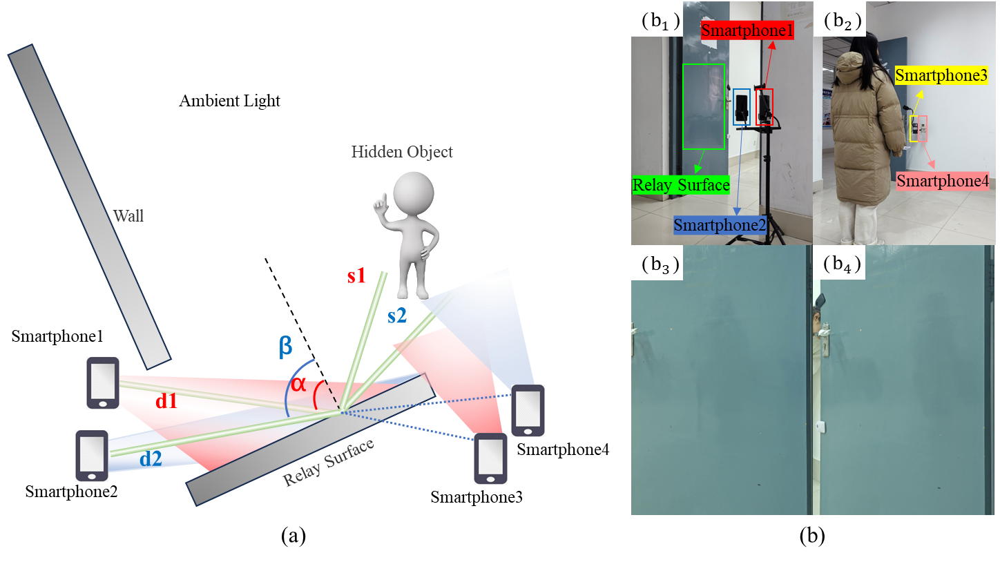
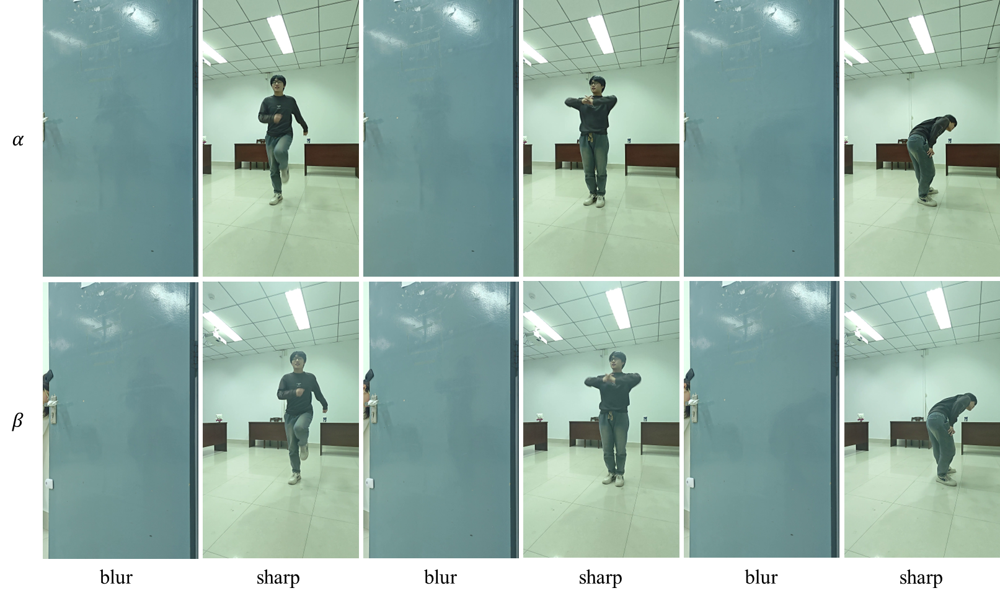
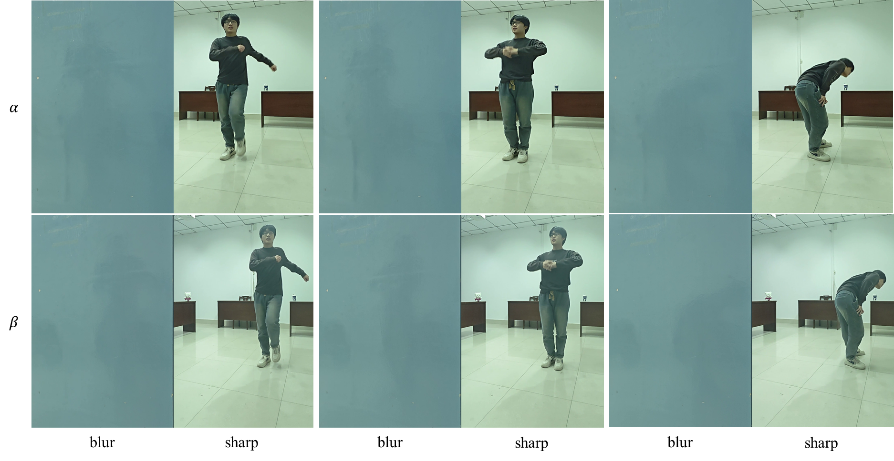

# MP-NLOS-dataset
Details of acquisition and processing for the multi-view passive non-line-of-sight NLOS dataset.

## Background & Motivation
Currently, most visible-light-based passive Non-Line-of-Sight (NLOS) datasets are acquired using images displayed on electronic screens or specific relay surfaces. These setups differ markedly from real-world scenarios and often restrict both the field of view and the diversity of information available for NLOS detection.

To overcome the traditional constraints of NLOS field-of-view perception, this paper introduces **MP-NLOS**, the first known multi-view dataset captured in real-world settings.

## Data Acquisition Setup
### Relay Surface & Configuration
- **Relay Surface:** A standard door.
- **Capture Devices:** Four smartphones.
- **Layout:** The setup captures **adjacent dual-view** data, as illustrated in Fig .1(a).
 
*
**Fig. 1.** The experimental scene setup for the MP-NLOS dataset.
*

### Smartphone Roles & Positioning
| Smartphone | Role | Distance to Center (`d`) | Incident Angle |
| :--- | :--- | :--- | :--- |
| **1 & 2** | Capture **shadow information** on the door. | `d1 = d2 = 120 cm` | `α = 35.69°` & `β = 41.81°` |
| **3 & 4** | Capture the corresponding **real-world scenes** (ground truth). | Along reflection paths `α` & `β` | Target distance `s1 = s2 = 180 cm` |

### Camera & Recording Parameters
To ensure high and consistent data quality, all smartphones were set to **Professional Mode** with the following standardized parameters:
- **Resolution:** 1080P
- **Frame Rate:** 300 FPS
- **White Balance (WB):** 5400K
- **Shutter Speed (S):** 1/60
- **ISO:** 100
- **Focus:** Fixed focal length

### Subjects & Trials
- **Subjects:** Five individuals, varying in gender, height, and clothing color.
- **Trials:** Each subject performed **5 to 6 trials** while holding different props.
- The experimental scene is shown in Fig .1(b).

## Data Processing Pipeline
### Step 1: Temporal Registration
1.  **Alignment:** Videos were loaded into Adobe Premiere Pro on a common canvas. The start and end frames of all videos were aligned using predefined anchor points.
2.  **Verification:** Frames were manually reviewed for synchronization.
3.  **Cleaning:** Out-of-sync frames were excluded via frame extraction, resulting in a video sequence with temporally consistent content.

### Step 2: Spatial Registration
1.  **Frame Extraction:** After temporal alignment, frames were extracted individually using custom code.
2.  **Filtering:** Images outside the anchor interval or with unclear ground truth were discarded.
3.  **Cropping & Resizing:** Each frame was cropped according to predetermined positioning points. All cropped images were then resized to a uniform dimension.

## Final Dataset Specifications
After completing temporal and spatial registration, the final processed MP-NLOS dataset contains:
- **Size:** Approximately **10,000 pairs** of NLOS and ground truth images **per viewing angle**.
- **Effective Field of View:**
    - For incident angle `α (35.69°)`: **40.3°**
    - For incident angle `β (41.81°)`: **47.2°**
- These FoV values are calculated based on the processed image depth and width.

The pre-processed images are shown in Fig. 2. 

Download Link: [https://pan.baidu.com/s/1P5Xv5DmpJzIoXWTCaqeqzw](https://pan.baidu.com/s/1P5Xv5DmpJzIoXWTCaqeqzw)  
Extraction Code: `afx6`

*
**Fig. 2.** Pre-processed images.
*

The post-processed images are shown in Fig. 3.

Download Link: [https://pan.baidu.com/s/1P5Xv5DmpJzIoXWTCaqeqzw](https://pan.baidu.com/s/1E5vw7fyaVvvBNbAiUEX9NQ)  
Extraction Code: `71t4`

*
**Fig. 3.** Post-processed images.
*
